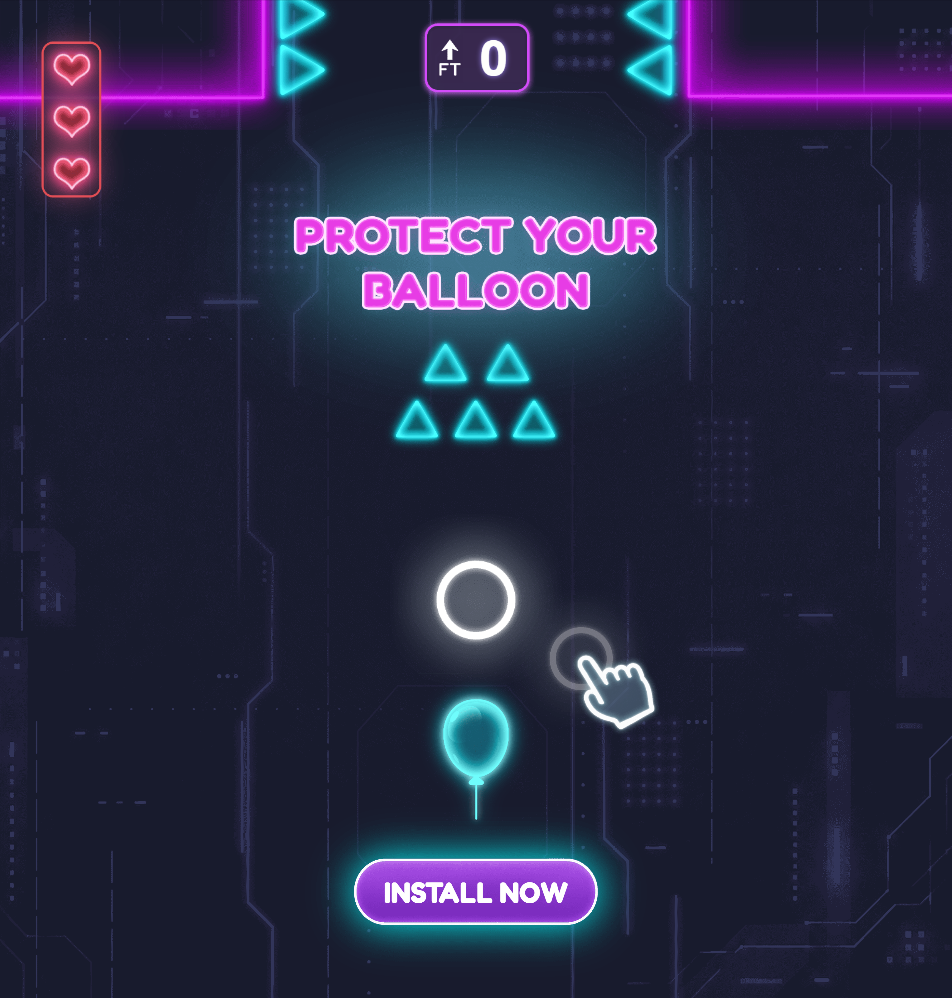
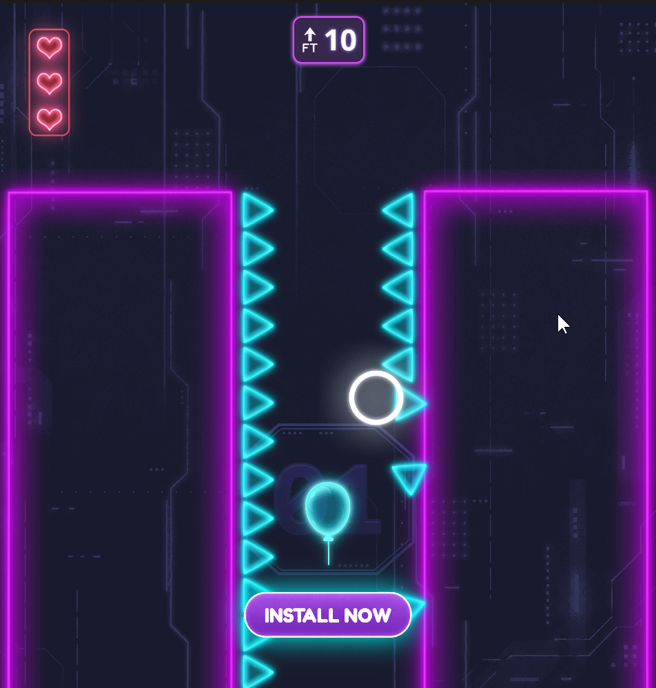
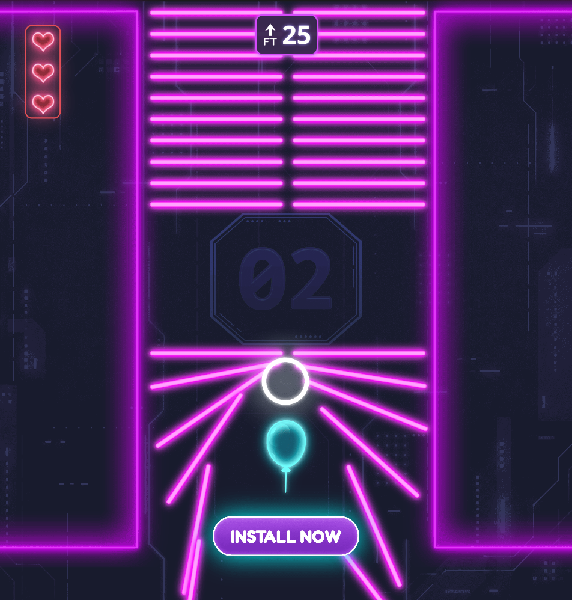
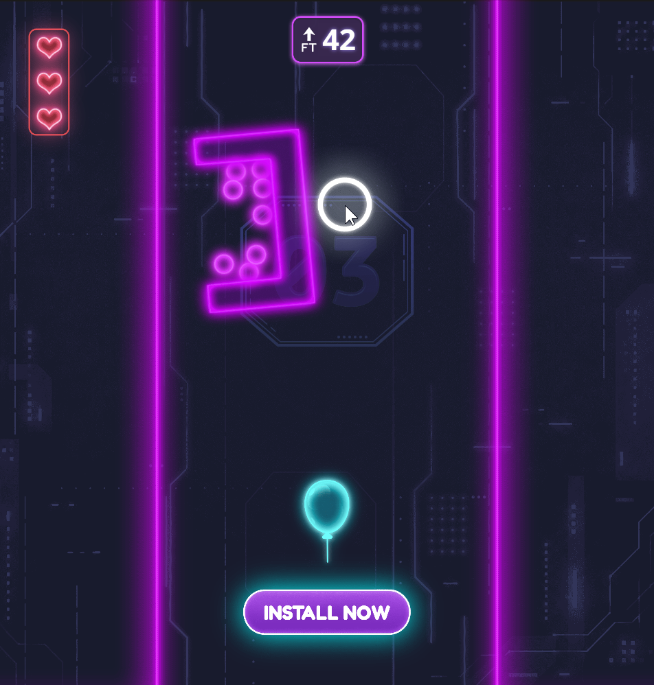
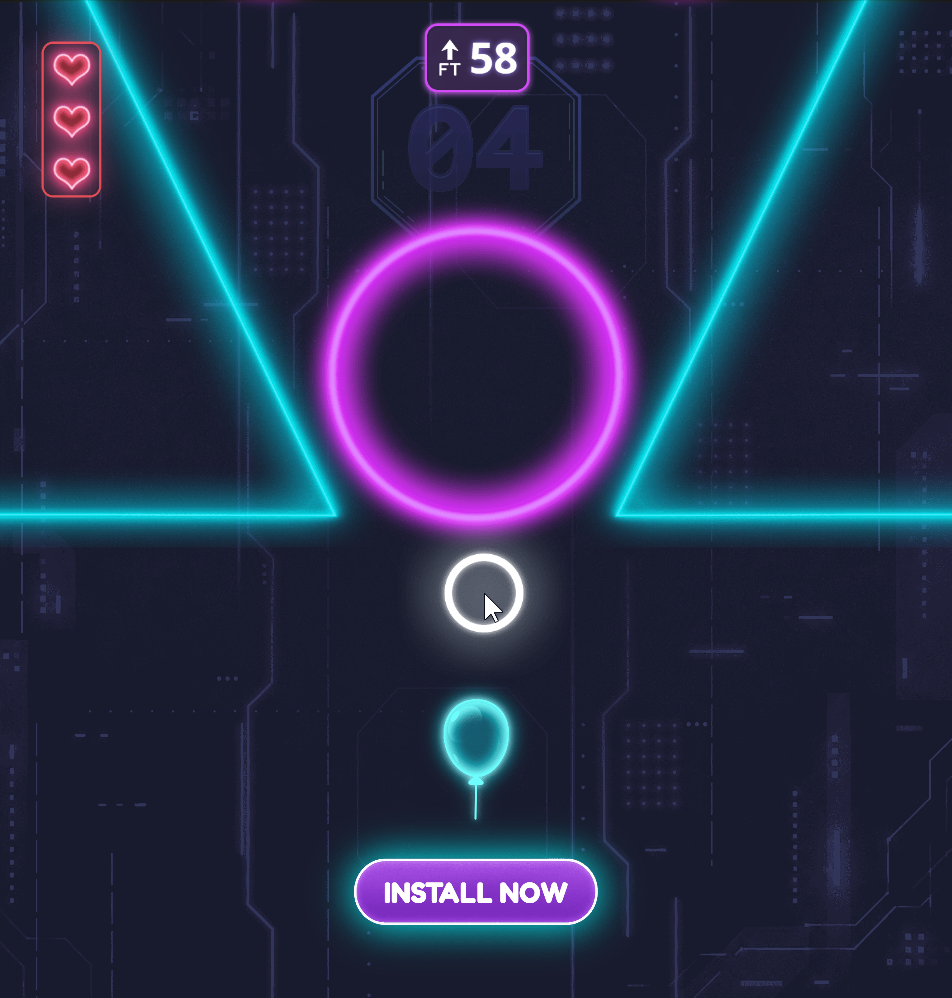
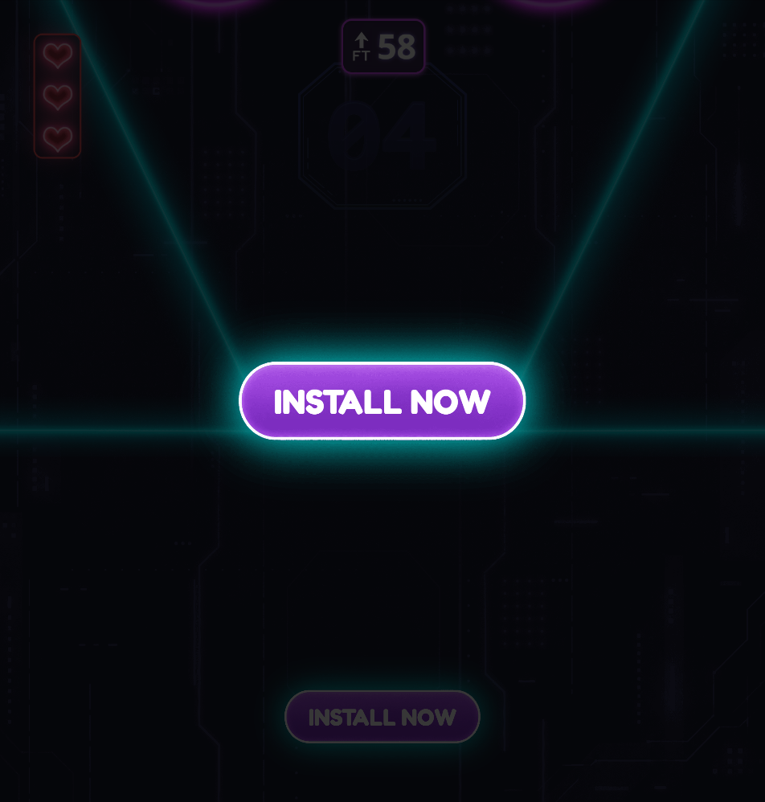
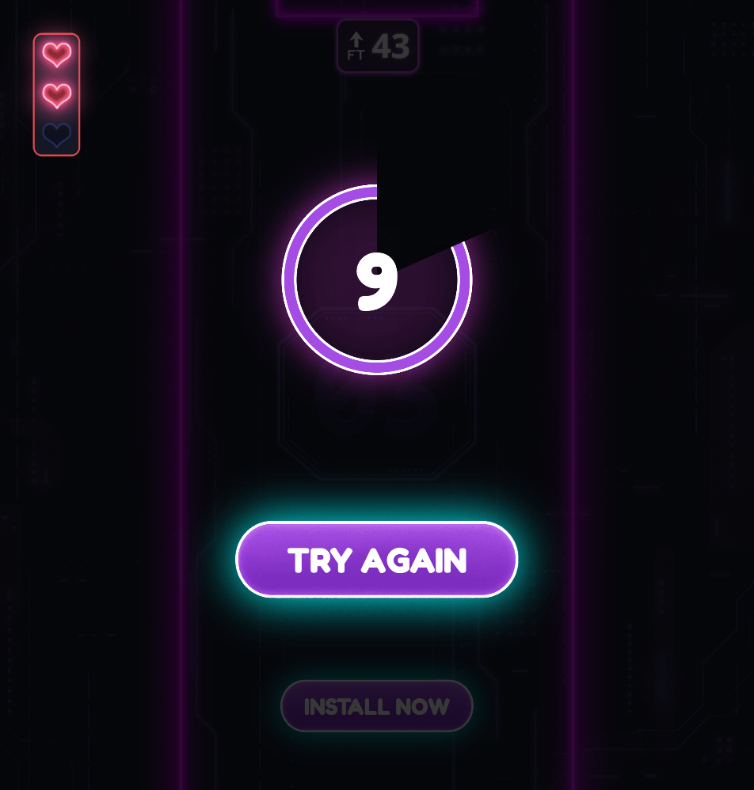

# Rise Up — Balloon Rise Up

[English version](README.md) · [← Портфолио](../README_RU.md)

Мобильный playable, в котором игрок двигает щит, чтобы расчищать физические препятствия перед автоматически поднимающимся воздушным шаром.

## Галерея

## Особенности

- Сенсорное управление щитом и физические препятствия.
- Чекпоинты и три жизни для повторных попыток.
- Обучающий UI, звук столкновений, fail-endcard и install CTA.
- Переиспользуемые префабы препятствий, туннелей, UI и шара.

## Ключевые файлы

- `assets/scripts/GameManager.ts` — игровой прогресс.
- `assets/scripts/BalloonController.ts` — поведение шара.
- `assets/scripts/ShieldController.ts` — управление игрока.
- `assets/scripts/PhysicsObstacle.ts` — препятствия.
- `assets/scene.scene` — главная сцена.

## Запуск

Откройте папку в Cocos Creator 3.8.8. Для проверки TypeScript выполните `npx tsc --noEmit`.
